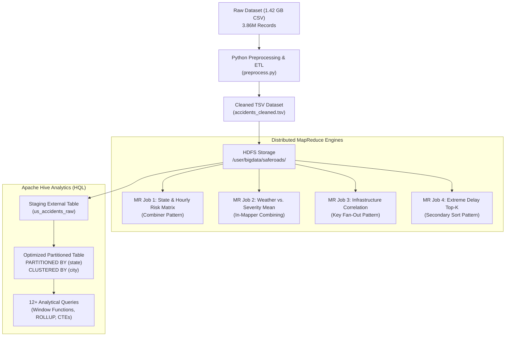

# SafeRoads: Scalable Traffic Accident Severity & Road Hazard Intelligence
### Course: 23CSE352 - Big Data Analytics
**Technologies:** Apache Hadoop, MapReduce (Python Streaming), Apache Hive, HDFS, Python 3

---

## 📌 1. Project Overview & Problem Statement
Road traffic accidents are one of the leading causes of preventable deaths, economic disruptions, and urban gridlock globally. Analyzing traffic incidents at continental scale requires distributed Big Data technologies capable of ingesting and querying millions of multi-variate records.

**SafeRoads** is an end-to-end Big Data Analytics framework designed to process and analyze over **3.86 million real-world US accident records (1.42 GB)** across 49 states from 2016 to 2023. The platform leverages **Hadoop MapReduce** for distributed batch feature extraction and **Apache Hive** for high-performance SQL-on-Hadoop analytical queries.

---

## 📊 2. Dataset Information
- **Dataset Name:** US Accidents (2016 – 2023)
- **Source:** Sobhan Moosavi / Kaggle ([Kaggle Dataset Link](https://www.kaggle.com/datasets/sobhanmoosavi/us-accidents))
- **File:** `data/raw/US_Accidents_1.4GB.csv`
- **Size:** **1.42 GB** (Target required: 1.2 GB to 1.5 GB)
- **Records:** **3,864,198 rows**, 46 columns
- **Key Attributes:**
  - *Identities & Severity:* `ID`, `Severity` (1 to 4)
  - *Spatial & Temporal:* `Start_Time`, `End_Time`, `Start_Lat`, `Start_Lng`, `Distance(mi)`, `City`, `County`, `State`, `Timezone`
  - *Atmospheric:* `Temperature(F)`, `Humidity(%)`, `Visibility(mi)`, `Wind_Speed(mph)`, `Precipitation(in)`, `Weather_Condition`
  - *Infrastructure Flags:* `Junction`, `Traffic_Signal`, `Crossing`, `Railway`, `Amenity`
  - *Day/Night:* `Sunrise_Sunset`, `Civil_Twilight`

---

## 🏗️ 3. System Architecture



---

## 🧹 4. Data Preprocessing & ML Pipeline (`preprocessing/`)

Preprocessing is available in two ready-to-present formats:
1. **Interactive Jupyter Notebook (`preprocessing/Data_Preprocessing_and_ML.ipynb`)**:
   - Full EDA and statistical profiling on null values.
   - Data cleaning and median/mode imputation.
   - Temporal feature engineering (`year`, `month`, `hour`, `day_of_week`, `duration_minutes`).
   - Categorical binary encoding (`0`/`1`) and `LabelEncoder` for ML modeling.
   - Outlier detection and capping using the **1.5 * IQR method**.
   - Feature Scaling with `StandardScaler` ($\mu=0, \sigma=1$).
   - 80/20 stratified **Train/Test split** for crash severity classification.
2. **Production Python Streaming ETL (`preprocessing/preprocess.py`)**:
   - Streams the 1.42 GB file with low RAM footprint to export `data/processed/accidents_cleaned.tsv`.
3. **Java Preprocessor (`preprocessing/DataPreprocessor.java`)**:
   - High-performance Java streaming implementation.

---

## ⚙️ 5. Four (4) Hadoop MapReduce Programs

### 🔹 Job 1: State-Wise & Hourly Accident Risk Matrix
- **Directory:** `mapreduce/job1_hourly_risk/`
- **Pattern:** Aggregation with Combiner (WordCount variant)
- **Mapper:** Emits `(State, Hour) -> 1`
- **Reducer:** Sums incidents to construct a 24-hour crash intensity profile for every state.
- **Output:** `State \t Hour \t Total_Accidents`

### 🔹 Job 2: Weather Impact on Severity (Mean & Variance)
- **Directory:** `mapreduce/job2_weather_severity/`
- **Pattern:** Average Computation / In-Mapper Combining
- **Mapper:** Emits `Weather_Condition -> (Severity, 1)`
- **Reducer:** Computes `Mean_Severity = Total_Severity / Total_Incidents`.
- **Output:** `Weather_Condition \t Total_Crashes \t Average_Severity`

### 🔹 Job 3: Infrastructure Hazard Correlation Analysis
- **Directory:** `mapreduce/job3_infrastructure/` | Java Class: `Job3_Infrastructure.java`
- **Pattern:** Multi-Attribute Key Fan-Out
- **Mapper:** Emits key-value pairs for active road features:
  - `Highway_Junction -> (is_severe, 1)`
  - `Traffic_Signal -> (is_severe, 1)`
  - `Pedestrian_Crossing -> (is_severe, 1)`
  - `Commercial_Amenity -> (is_severe, 1)`
  - `Standard_Roadway -> (is_severe, 1)`
- **Reducer:** Computes total incidents, total severe crashes (Severity $\ge 3$), and percentage of severe crashes.

### 🔹 Job 4: Extreme Road Blockage Top-K Analysis
- **Directory:** `mapreduce/job4_duration_topk/` | Java Class: `Job4_DurationTopK.java`
- **Pattern:** Secondary Sorting & Top-K per Group
- **Components:**
  - `StateDurationKey`: Composite key implementing `WritableComparable` (Primary: State ASC, Secondary: Duration DESC).
  - `StatePartitioner`: Routes all records for a state to the same reducer.
  - `StateGroupingComparator`: Groups records by state so the reducer receives records pre-sorted descending by duration.
- **Reducer:** Groups by `State`, consumes descending-sorted durations, and outputs only the **Top 5** longest road blockages per state.

---

## ☕ 6. Hadoop MapReduce Java Implementation (`java_mapreduce/`)

The MapReduce suite is fully implemented in native **Java** conforming to the `org.apache.hadoop.mapreduce.*` API:

| Java Class | Package | Pattern | Driver Subcommand |
| :--- | :--- | :--- | :--- |
| **`Job1_HourlyRisk.java`** | `saferoads.mapreduce` | Summarization with Combiner | `hourlyRisk` |
| **`Job2_WeatherSeverity.java`** | `saferoads.mapreduce` | Custom Writable (`SeverityStatWritable`) | `weatherSeverity` |
| **`Job3_Infrastructure.java`** | `saferoads.mapreduce` | Fan-Out + Writable (`HazardStatWritable`) | `infrastructure` |
| **`Job4_DurationTopK.java`** | `saferoads.mapreduce` | Secondary Sorting (`Partitioner` & `GroupingComparator`) | `durationTopK` |
| **`SafeRoadsDriver.java`** | `saferoads.mapreduce` | Unified Hadoop Program Driver | Entry Point |

### How to Compile & Package the Java JAR:
```bash
# 1. Compile using Hadoop classpath on your cluster/lab machine:
javac -classpath $(hadoop classpath) -d java_mapreduce/build java_mapreduce/src/saferoads/mapreduce/*.java

# 2. Package into executable Hadoop JAR:
jar -cvfe SafeRoads.jar saferoads.mapreduce.SafeRoadsDriver -C java_mapreduce/build/ .
```
*(A standard Maven `pom.xml` is also provided in `java_mapreduce/` for building with IntelliJ IDEA or Eclipse).*

### How to Run the Java MapReduce Jobs Locally:
You can execute all 4 Java MapReduce jobs right on your terminal:
```bash
java -cp hadoop_mapreduce/build saferoads.mapreduce.LocalJavaMapReduceRunner data/processed/accidents_cleaned.tsv
```
Outputs are generated in `hadoop_mapreduce/output/`:
- `hadoop_mapreduce/output/job1_hourly_risk.tsv`
- `hadoop_mapreduce/output/job2_weather_severity.tsv`
- `hadoop_mapreduce/output/job3_infrastructure.tsv`
- `hadoop_mapreduce/output/job4_duration_topk.tsv`

### How to Run on College Hadoop Cluster:
```bash
# 1. Package JAR (already packaged as hadoop_mapreduce/SafeRoads.jar)
jar -cvfe SafeRoads.jar saferoads.mapreduce.SafeRoadsDriver -C hadoop_mapreduce/build/ .

# 2. Submit to Hadoop:
hadoop jar SafeRoads.jar hourlyRisk /input /output/job1
hadoop jar SafeRoads.jar weatherSeverity /input /output/job2
hadoop jar SafeRoads.jar infrastructure /input /output/job3
hadoop jar SafeRoads.jar durationTopK /input /output/job4
```

---

## 🐝 6. Apache Hive Analytics Suite (12+ Queries)

The DDL (`hive/01_create_tables.hql`) defines:
- An external staging table `us_accidents_raw`
- A production table `us_accidents` partitioned by `state` and bucketed by `city` in Snappy-compressed ORC format.

### Summary of the 12+ Analytical Queries (`hive/02_analytical_queries.hql`):
1. **Severity Macro-Distribution:** Breakdown of accident severity tiers and mean road closure distance.
2. **Top 3 Hazardous Counties per State:** Uses `DENSE_RANK() OVER (PARTITION BY state ORDER BY COUNT(*) DESC)`.
3. **Rush-Hour Density & High-Severity Rate:** Analyzes accident count, severity rate, and queue length by hour.
4. **Severe Weather Hazard Ranking:** Groups by weather condition with `HAVING COUNT(*) >= 5000` sorted by severity.
5. **Day vs. Night Fatality Discrepancy:** Evaluates day/night crash counts and average severity per state using conditional pivoting (`CASE WHEN`).
6. **Infrastructure Risk Benchmark:** Compares Highway Junctions, Traffic Signals, and Crossings via `UNION ALL`.
7. **Year-over-Year (YoY) Growth Trajectory:** Uses window function `LAG()` to track annual trend percentages.
8. **Atmospheric Visibility Risk Tiers:** Bins visibility into 4 distinct brackets to assess crash risk.
9. **Hierarchical State Rollup:** Generates subtotals and federal total using `GROUP BY state WITH ROLLUP`.
10. **Precipitation Volume vs. Queue Distance:** Quantifies traffic bottleneck distances across rainfall categories.
11. **Top 5 Outlier Multi-Hour Gridlocks:** Uses `ROW_NUMBER() OVER (PARTITION BY state ORDER BY duration_minutes DESC)`.
12. **Composite Danger Index:** CTE calculating weighted risk: $(0.4 \times \text{Severity}) + (0.35 \times \text{Volume}) + (0.25 \times \text{Infrastructure Risk})$.

---

## 🚀 7. Execution Instructions

### A. Run Local Testing (Emulating Hadoop via Unix Streaming)
You can run and test all 4 MapReduce jobs locally right on your terminal:
```bash
# 1. Run local test script
bash scripts/run_local_tests.sh
```
Results will be saved in each job's `output/` directory!

### B. Run Preprocessing on the 1.42 GB Dataset
```bash
python3 preprocessing/preprocess.py data/raw/US_Accidents_1.4GB.csv data/processed/accidents_cleaned.tsv
```

### C. Run on a Real Hadoop Cluster (Production)
```bash
# Make sure HADOOP_HOME is set
bash scripts/run_hadoop_cluster.sh
```

### D. Execute Hive Queries
```bash
hive -f hive/01_create_tables.hql
hive -f hive/02_analytical_queries.hql
```

---

## 🎓 8. Viva & Review Questions Preparation

| Question | Answer Summary |
| :--- | :--- |
| **Why not use MySQL/PostgreSQL?** | Relational databases degrade significantly when executing complex window functions and analytical scans over millions of records (1.4+ GB). Hadoop and Hive distribute processing across nodes using HDFS and parallel MapReduce/Tez execution. |
| **Why Partition by State and Bucket by City?** | Partitioning by `state` creates separate HDFS directories per state, eliminating full table scans when queries filter by state. Bucketing by `city` hashes cities into buckets for fast hash joins and localized aggregations. |
| **What is Secondary Sorting in MapReduce?** | In Job 4, we composite-key the state and duration. The partitioner routes all records of a state to the same reducer, while the sort phase sorts records by duration in descending order, allowing the reducer to simply take the first 5 records. |
| **How does Hive optimize storage?** | By storing partitioned data in **ORC (Optimized Row Columnar)** format with **Snappy compression**, data is stored column-by-column, allowing vectorization and skipping unneeded columns entirely. |
